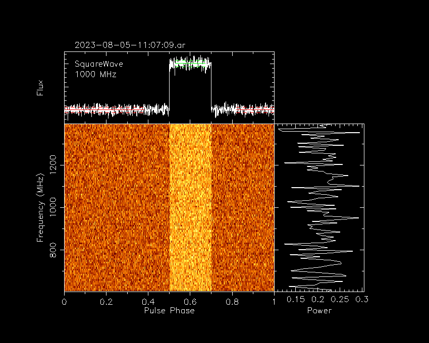

.. _operation_notebook:

.. raw:: html

    

.. role:: red

Example Usage
========================================

Square-wave modulated noise
----------------------------------------

To generate a simulated voltage recorder observation of normally-distributed white noise in which the intensity is periodically modulated
by a square wave, set up two configuration files (one for data and one for weights); e.g.

Example data_config.txt ::

    HDR_VERSION   1.0

    HDR_SIZE      4096
    NPOL          2
    NDIM          2
    NCHAN         96
    NBIT          16

    TELESCOPE     SKA1-Low
    INSTRUMENT    LowCBF
    SOURCE        SquareWave
    MODE          CAL

    CALFREQ           10.0  # Hz
    CAL_DUTY_CYCLE    0.2
    CAL_OFF_INTENSITY 5.0
    CAL_ON_INTENSITY  6.0

    START_CHANNEL 0

    UDP_NSAMP     32
    WT_NSAMP      32
    UDP_NCHAN     24

    UTC_START     2023-08-05-11:07:09
    OBS_OFFSET    0

    FREQ          1000
    BW            3.7037 # MHz
    TSAMP         25.92  # microseconds

Example data_config.txt ::

    HDR_VERSION   1.0

    HDR_SIZE      4096
    NPOL          1
    NDIM          1
    NCHAN         96
    NBIT          16

    TELESCOPE     SKA1-Low
    INSTRUMENT    LowCBF
    SOURCE        SquareWave
    MODE          CAL

    UDP_NSAMP     32
    WT_NSAMP      32
    UDP_NCHAN     24

    UTC_START     2023-08-05-11:07:09
    OBS_OFFSET    0

    FREQ          1000
    BW            3.7037 # MHz
    TSAMP         829.44 # microseconds

Generate one second of simulated data with

.. code-block:: bash

    ska_pst_generate_file -d data_config.txt -w weights_config.txt -s SquareWave -T1.0

To process the signal using dspsr, first create a dual-file input meta file; e.g.

.. code-block:: bash

    ls data/*.dada > data.ls
    ls weights/*.dada > weights.ls
    cat > dual.ls << EOD
    DUAL FILE:
    data.ls
    weights.ls
    EOD

Then run dspsr

.. code-block:: bash

    dspsr dual.ls

The output data file is named ``2023-08-05-11:07:09.ar`` (corresponding to the ``UTC_START`` in the configuration file) and 
the contents of this file can be plotted with

.. code-block:: bash

    psrplot -p freq+ 2023-08-05-11:07:09.ar -j p -j "r .5" -D /xs

This will plot a phase-vs-frequency image of the pulsed intensity, with the power from both polarizations added together,
like the following

